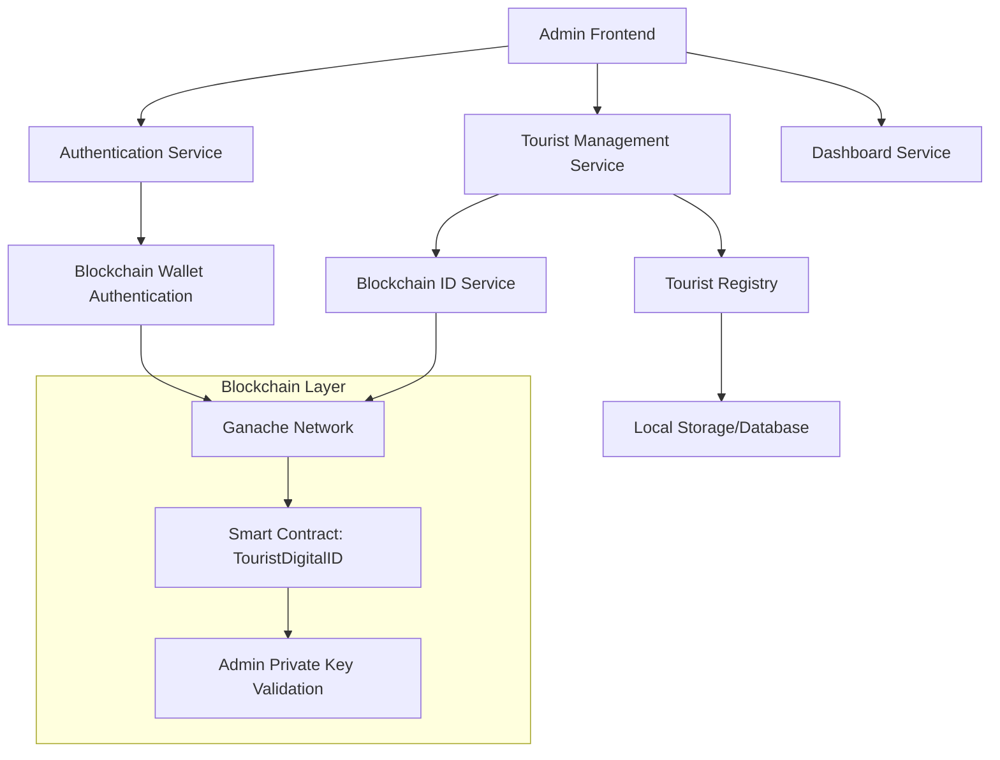
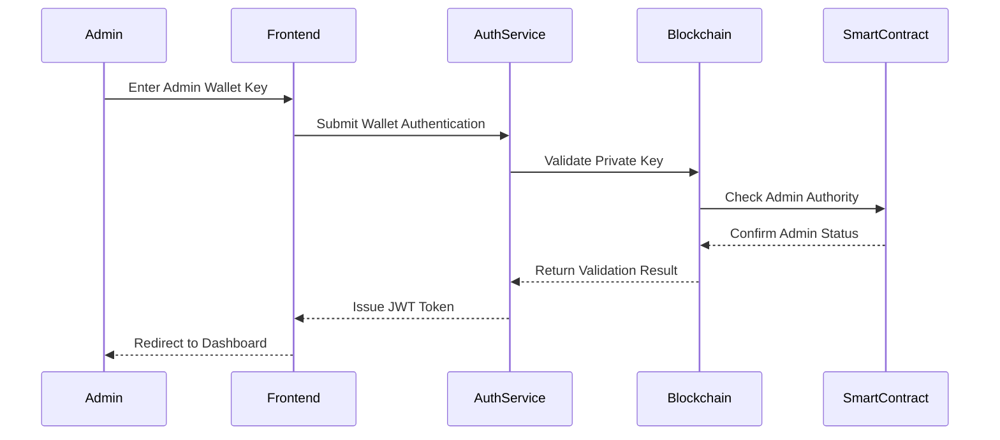
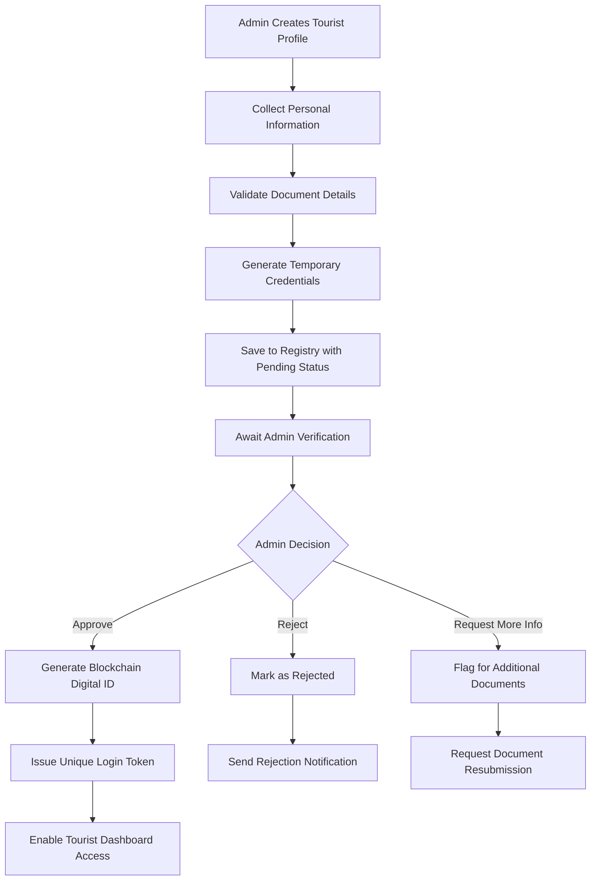
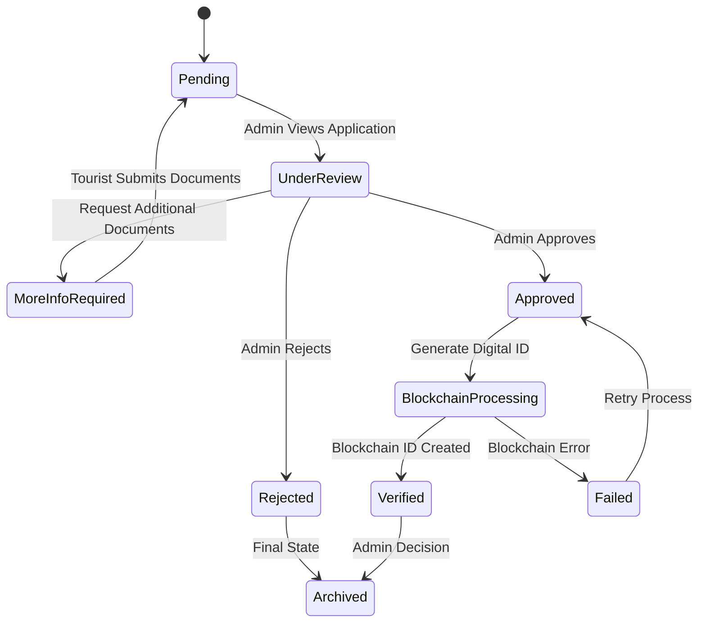
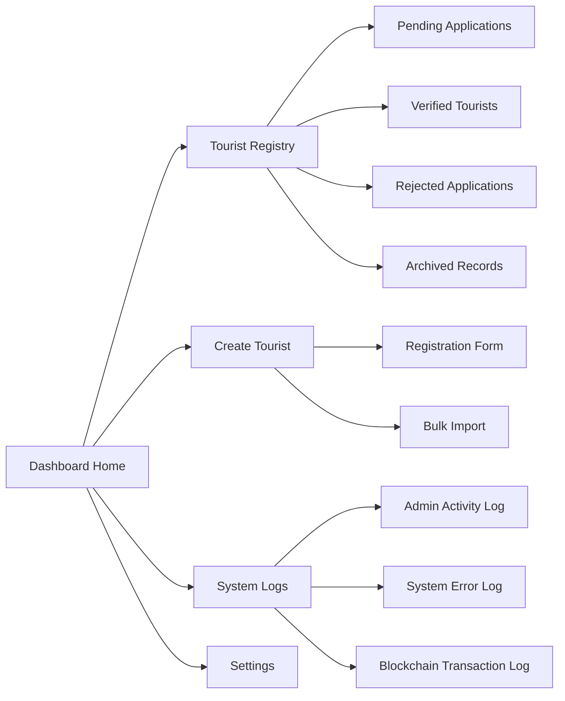
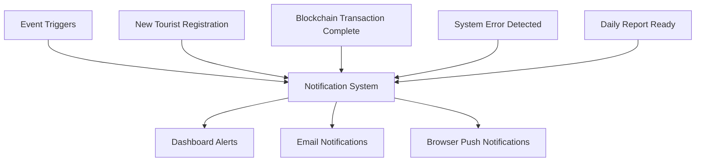
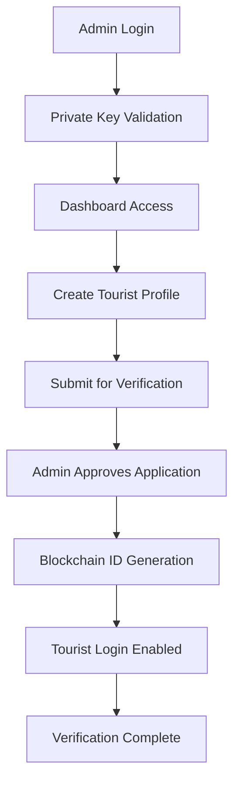

# Admin Authentication and Dashboard Design

## Overview

This design document outlines the comprehensive admin-side authentication and management system for the Smart Tourist Safety Platform (YatraRakshak). The admin system enables authorized personnel to manage tourist registrations, verify digital identities, and oversee the blockchain-backed authentication infrastructure.

## Architecture

### System Components

### Authentication Flow

## Admin Authentication System

### Wallet-Based Authentication

The admin authentication system utilizes blockchain wallet private keys as the primary authentication mechanism, ensuring secure and decentralized access control.

#### Authentication Requirements

| Component | Specification |
|-----------|---------------|
| **Wallet Type** | Ethereum-compatible wallet (Ganache Account) |
| **Key Format** | 64-character hexadecimal string with 0x prefix |
| **Network** | Ganache Local Network (Chain ID: 1337) |
| **Contract Role** | Admin authority verified through smart contract |
| **Session Duration** | 8 hours with automatic token refresh |

#### Security Validation Process

1. **Private Key Validation**: Verify key format and mathematical validity
2. **Network Connectivity**: Confirm connection to Ganache blockchain
3. **Smart Contract Authority**: Validate admin role through TouristDigitalID contract
4. **Account Balance**: Ensure sufficient ETH for transaction processing
5. **Rate Limiting**: Implement login attempt restrictions

### Authentication Data Models

#### Admin Profile Structure

| Field | Type | Description |
|-------|------|-------------|
| `_id` | String | Unique admin identifier |
| `walletAddress` | String | Ethereum wallet public address |
| `privateKeyHash` | String | Hashed private key for verification |
| `role` | Enum | `admin` or `senior_admin` |
| `name` | String | Admin display name |
| `email` | String | Contact email address |
| `createdAt` | DateTime | Account creation timestamp |
| `lastLogin` | DateTime | Most recent login time |
| `isActive` | Boolean | Account status flag |
| `permissions` | Array | Granular permission set |

#### Authentication Session

| Field | Type | Description |
|-------|------|-------------|
| `sessionId` | String | Unique session identifier |
| `adminId` | String | Reference to admin profile |
| `walletAddress` | String | Associated wallet address |
| `jwtToken` | String | Authentication bearer token |
| `expiresAt` | DateTime | Session expiration time |
| `ipAddress` | String | Client IP for security tracking |
| `userAgent` | String | Browser fingerprint |

## Tourist Registration Management

### Registration Workflow

### Tourist Creation Interface

#### Form Data Structure

| Field | Type | Validation | Required |
|-------|------|------------|----------|
| `name` | String | 2-100 characters, alphabetic | Yes |
| `email` | String | Valid email format | Yes |
| `phone` | String | 10-15 digits, country code optional | Yes |
| `emergencyName` | String | 2-100 characters | Yes |
| `emergencyPhone` | String | 10-15 digits | Yes |
| `documentType` | Enum | `aadhaar` or `passport` | Yes |
| `documentNumber` | String | Format validation per type | Yes |
| `itinerary` | Text | Max 1000 characters | No |
| `tempPassword` | String | Auto-generated 12-character string | System |

#### Business Logic Rules

1. **Email Uniqueness**: Prevent duplicate registrations
2. **Document Validation**: Verify Aadhaar (12 digits) or Passport format
3. **Emergency Contact**: Cannot be same as primary contact
4. **Temporary Password**: System-generated, expires after first login
5. **Initial Status**: All new registrations start as "pending"

## Tourist Registry Verification

### Verification Dashboard

The registry verification system provides admins with a comprehensive interface to review and process tourist applications.

#### Registry Data Display

| Column | Content | Actions Available |
|--------|---------|-------------------|
| **Application ID** | Auto-generated unique identifier | View Details |
| **Tourist Name** | Full name from registration | Search/Filter |
| **Email** | Contact email address | Contact Tourist |
| **Document Type** | Aadhaar or Passport indicator | View Document |
| **Application Date** | Submission timestamp | Sort by Date |
| **Current Status** | Pending/Verified/Rejected/Archived | Status Filter |
| **Actions** | Context-sensitive buttons | Approve/Reject/Archive |

#### Verification Process

### Blockchain Digital ID Generation

#### ID Creation Process

| Step | Action | Technology Component |
|------|--------|---------------------|
| 1 | Admin Approval Trigger | Express.js Backend |
| 2 | Compile Tourist Data | Tourist Registry |
| 3 | Generate Payload | Blockchain Service |
| 4 | Submit to Smart Contract | Ganache Network |
| 5 | Transaction Processing | TouristDigitalID Contract |
| 6 | Generate QR Code | QR Code Library |
| 7 | Update Tourist Record | Local Database |
| 8 | Issue Login Credentials | Authentication Service |

#### Digital ID Data Structure

| Field | Type | Source | Purpose |
|-------|------|--------|---------|
| `blockchainId` | String | Smart contract sequence | Unique on-chain identifier |
| `userId` | String | Tourist profile reference | Link to local record |
| `name` | String | Tourist registration | Identity verification |
| `documentHash` | String | SHA-256 of document | Privacy-preserving verification |
| `validUntil` | DateTime | Admin-set expiration | Temporal access control |
| `transactionHash` | String | Blockchain transaction | Immutable proof |
| `qrCodeData` | String | Base64 encoded image | Mobile verification |
| `specialLoginId` | String | YR-prefixed unique ID | Tourist login credential |

## Admin Dashboard

### Dashboard Overview

The admin dashboard provides a comprehensive view of system status, pending applications, and administrative tools.

#### Key Metrics Display

| Metric | Calculation | Update Frequency |
|--------|-------------|------------------|
| **Total Pending Applications** | Count of status = "pending" | Real-time |
| **Applications Today** | Today's submission count | Real-time |
| **Verification Rate** | Approved / Total Applications | Daily |
| **Average Processing Time** | Time from submission to decision | Weekly |
| **Active Digital IDs** | Valid blockchain IDs | Real-time |
| **System Health Status** | Blockchain connectivity check | Every 5 minutes |

#### Navigation Structure

### Dashboard Features

#### Quick Actions Panel

| Action | Description | Access Level |
|--------|-------------|--------------|
| **Create New Tourist** | Launch registration form | All Admins |
| **View Pending** | Filter registry to pending items | All Admins |
| **Bulk Operations** | Mass approve/reject capabilities | Senior Admin |
| **Export Data** | Download registry reports | All Admins |
| **System Health** | Check blockchain connectivity | All Admins |
| **User Management** | Manage admin accounts | Senior Admin |

#### Real-time Notifications

## Security Architecture

### Access Control Matrix

| Resource | Admin | Senior Admin | Notes |
|----------|-------|--------------|-------|
| **Tourist Registration** | Create, View | Create, View, Bulk | Individual vs. bulk operations |
| **Application Approval** | Approve, Reject | Approve, Reject, Override | Standard verification process |
| **Digital ID Management** | Generate, View | Generate, View, Revoke | ID lifecycle management |
| **System Logs** | View Own Actions | View All Actions | Audit trail access |
| **Admin Management** | View Profile | Manage All Admins | User administration |
| **Blockchain Operations** | Standard Operations | Advanced Operations | Smart contract interactions |

### Security Measures

#### Authentication Security

| Security Layer | Implementation | Purpose |
|----------------|----------------|---------|
| **Private Key Protection** | Client-side hashing before transmission | Prevent key exposure |
| **Session Management** | JWT with 8-hour expiration | Limit exposure window |
| **Account Lockout** | 3 failed attempts, 15-minute lockout | Prevent brute force |
| **IP Whitelisting** | Optional admin IP restrictions | Network-level security |
| **Audit Logging** | All admin actions logged | Compliance and monitoring |

#### Data Protection

| Data Type | Protection Method | Retention Policy |
|-----------|------------------|------------------|
| **Private Keys** | Hashed with salt, never stored plain | Session only |
| **Tourist Documents** | SHA-256 hash only | Indefinite |
| **Personal Information** | Encrypted at rest | As per compliance |
| **Session Data** | Encrypted tokens | 8 hours maximum |
| **Audit Logs** | Immutable append-only | 7 years |

## Testing Strategy

### Authentication Testing

#### Wallet Authentication Tests

| Test Case | Input | Expected Result |
|-----------|-------|-----------------|
| **Valid Private Key** | Correct 64-char hex key | Successful authentication |
| **Invalid Format** | Malformed key string | Validation error |
| **Wrong Network** | Key from different network | Network mismatch error |
| **Insufficient Balance** | Valid key, low ETH balance | Warning with continued access |
| **Revoked Admin** | Valid key, disabled admin | Access denied |

#### Session Management Tests

| Test Case | Scenario | Expected Behavior |
|-----------|----------|-------------------|
| **Token Expiration** | 8-hour session timeout | Automatic logout redirect |
| **Concurrent Sessions** | Multiple browser sessions | All sessions valid |
| **Session Hijacking** | Invalid IP address | Security alert, optional lockout |
| **Refresh Token** | Near-expiration token refresh | Seamless extension |

### Integration Testing

#### Blockchain Integration Tests

| Component | Test Scenario | Success Criteria |
|-----------|---------------|------------------|
| **Smart Contract** | Admin authority validation | Correct role verification |
| **Digital ID Creation** | Tourist approval process | Valid blockchain ID generated |
| **Transaction Processing** | Batch operations | All transactions successful |
| **Error Handling** | Network connectivity loss | Graceful fallback behavior |

#### End-to-End Testing

