# Authentication System Design for YatraRakshak

## Overview

The YatraRakshak platform requires a robust authentication system supporting two distinct user types: **Tourists** and **Admins**. Each user type has different access patterns, verification requirements, and dashboard experiences. This design outlines the strategic architecture for implementing secure, role-based authentication with separate signin flows.

## Architecture

### High-Level Authentication Flow

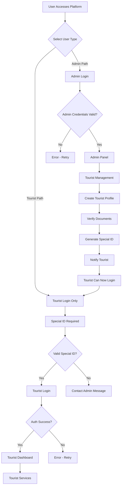

### Role-Based Access Control

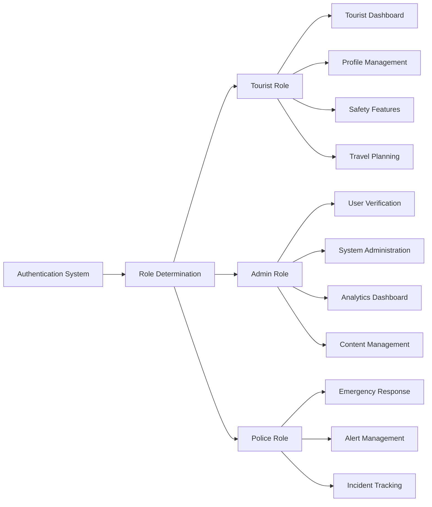

## User Authentication Paths

### Tourist Authentication Journey

#### Application and Verification Process

Tourists cannot directly register or login. The process is admin-initiated and follows a strict verification workflow:

| Stage | Initiated By | Description | Validation Requirements | Next Action |
|-------|--------------|-------------|------------------------|-------------|
| Tourist Registration | Admin | Admin creates tourist profile | Basic identity details validation | Document Collection |
| Document Collection | Admin | Admin uploads tourist documents | Aadhaar/Passport verification | Identity Verification |
| Identity Verification | Admin | Admin verifies documents and identity | Manual document authenticity check | Approval Decision |
| Approval & ID Generation | Admin | Admin approves and generates special ID | Admin approval with blockchain ID creation | Tourist ID Issued |
| Tourist Notification | System | Tourist receives special login ID | Valid contact information | Login Access Granted |

#### Tourist Login Process (Post-Verification Only)

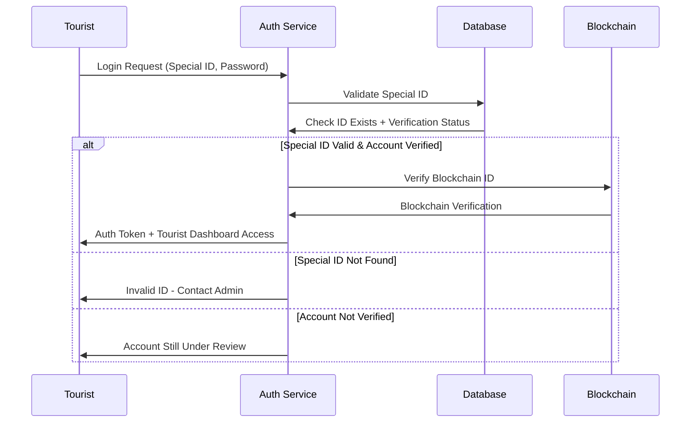

### Admin Authentication Journey

#### Admin Access Control

Admins have immediate access after credential validation and are responsible for tourist registration:

| Component | Purpose | Security Level |
|-----------|---------|----------------|
| Credential Validation | Email/password verification | Standard authentication |
| Role Verification | Confirm admin privileges | Role-based access control |
| Tourist Management | Create and verify tourist accounts | Full tourist lifecycle control |
| ID Generation | Generate special login IDs for tourists | Secure ID generation with uniqueness |
| Session Management | Secure session handling | Token-based with refresh |
| Activity Logging | Audit trail maintenance | Comprehensive action logging |

#### Admin Login Flow

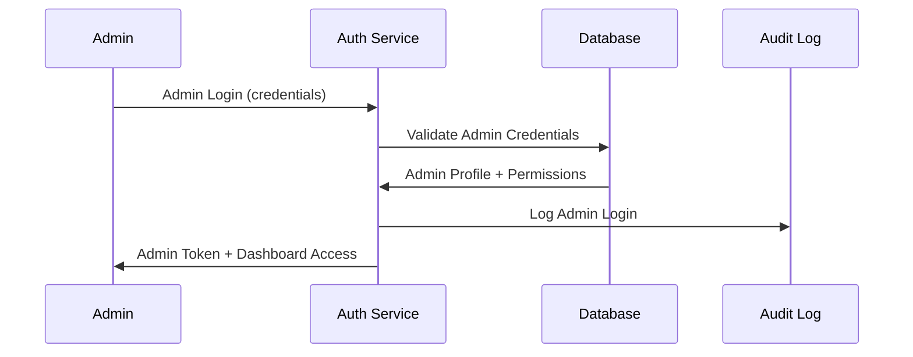

## Data Models & Security

### User Data Architecture

#### Tourist Profile Structure

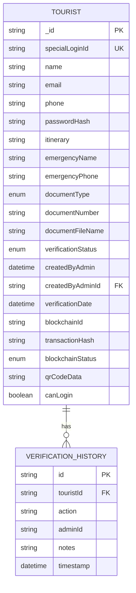

#### Admin Profile Structure

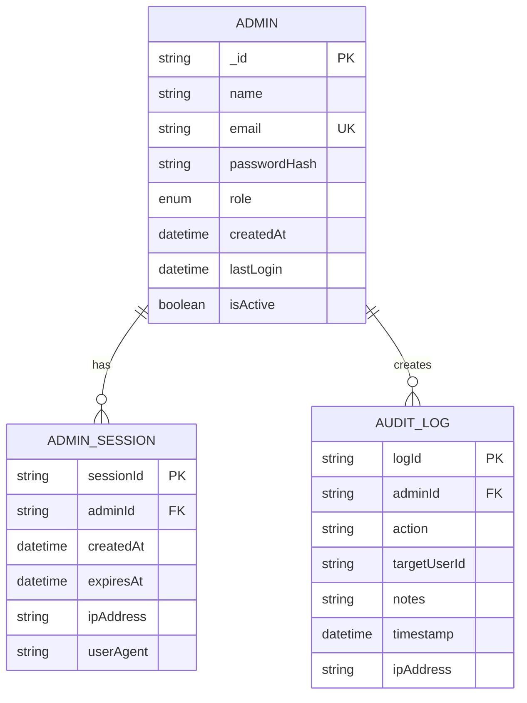

### Authentication Security Framework

#### Password Security Strategy

| Aspect | Implementation | Rationale |
|--------|----------------|-----------|
| Hashing Algorithm | bcrypt with salt rounds ≥ 12 | Industry standard for password security |
| Password Requirements | Minimum 6 characters for tourists, 8+ for admins | Balanced security and usability |
| Failed Attempt Handling | Progressive lockout after 3 attempts | Prevent brute force attacks |
| Password Reset | Secure token-based reset flow | Account recovery without security compromise |

#### Session Management

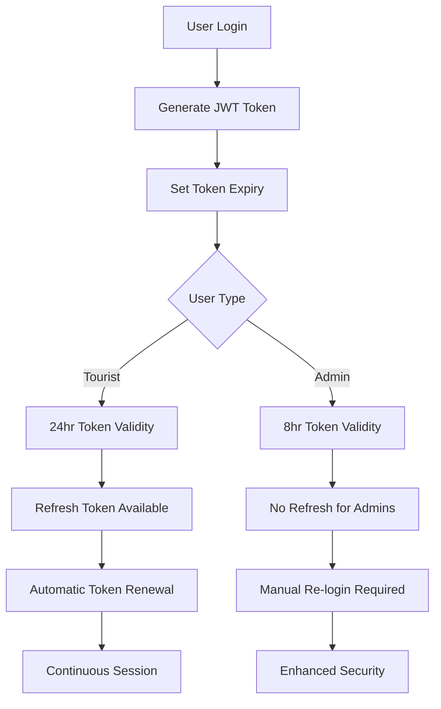

## API Endpoints Reference

### Authentication Endpoints

#### Tourist Authentication

| Endpoint | Method | Purpose | Request Schema | Response Schema |
|----------|--------|---------|----------------|------------------|
| `/api/auth/tourist-login` | POST | Tourist login with special ID | Special ID, password | Auth token + tourist dashboard access |
| `/api/auth/validate-special-id` | POST | Check if special ID exists | Special ID | ID validity + account status |
| `/api/tourist/profile/:specialId` | GET | Retrieve tourist profile | Special ID in path | Tourist profile data |
| `/api/tourist/digital-id/:specialId` | GET | Get digital ID status | Special ID in path | Blockchain verification + QR code |

#### Admin Authentication & Tourist Management

| Endpoint | Method | Purpose | Request Schema | Response Schema |
|----------|--------|---------|----------------|------------------|
| `/api/auth/admin-login` | POST | Admin login | Email, password | Auth token + admin dashboard access |
| `/api/admin/create-tourist` | POST | Create new tourist profile | Tourist data + documents | Tourist ID + special login ID |
| `/api/admin/pending-verifications` | GET | List pending tourists | Query params: status, page, search | Paginated tourist list |
| `/api/admin/verify-tourist/:userId` | POST | Verify and approve tourist | User ID + verification notes | Special ID + blockchain ID |
| `/api/admin/reject-tourist/:userId` | POST | Reject tourist verification | User ID + rejection reason | Updated status |
| `/api/admin/generate-special-id/:userId` | POST | Generate special login ID | User ID | Special ID for tourist login |
| `/api/admin/logs` | GET | Admin activity audit | None | Chronological admin actions |

### Authentication Requirements

#### Token-Based Security

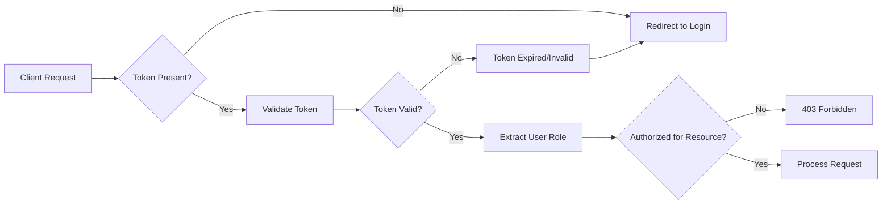

#### Role-Based Route Protection

| Route Pattern | Required Role | Additional Checks |
|---------------|---------------|-------------------|
| `/tourist/login` | None | Special ID validation required |
| `/profile` | Tourist | Own profile access only + valid special ID |
| `/tourist/dashboard` | Tourist | Verified status + valid special ID required |
| `/admin` | Admin | Active admin status |
| `/admin/tourist-management` | Admin | Tourist creation and verification permissions |
| `/admin/logs` | Admin | Senior admin or audit permission |
| `/police/dashboard` | Police | Active police status |

## Business Logic Layer

### Tourist Verification Workflow

#### Admin-Initiated Tourist Creation Process

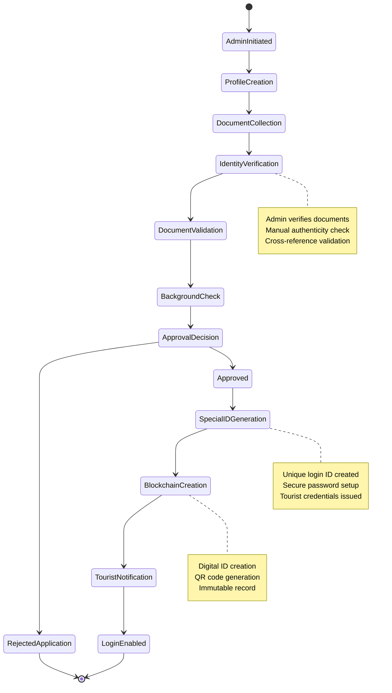

#### Verification Criteria

| Document Type | Validation Requirements | Processing Time | Success Rate |
|---------------|------------------------|-----------------|--------------|
| Aadhaar Card | 12-digit number format, file upload | 24-48 hours | 95% |
| Passport | Valid passport number, clear image | 48-72 hours | 90% |
| Emergency Contact | Valid phone number, relationship verification | Immediate | 98% |
| Travel Itinerary | Detailed plan, realistic timeline | 2-4 hours | 85% |

### Admin Management Operations

#### Tourist Registration Decision Matrix

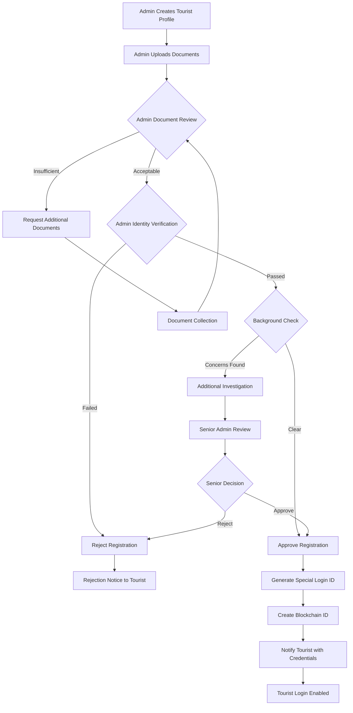

#### Admin Action Audit Trail

| Action Type | Required Information | Audit Fields | Retention Period |
|-------------|---------------------|--------------|------------------|
| Create Tourist Profile | Tourist details, document uploads | Admin ID, timestamp, IP, profile data | Permanent |
| Verify Tourist Identity | User ID, verification result | Admin ID, timestamp, verification notes | Permanent |
| Generate Special ID | User ID, generated credentials | Admin ID, timestamp, special ID issued | Permanent |
| Approve Tourist | User ID, approval reason | Admin ID, timestamp, IP, notes | Permanent |
| Reject Registration | User ID, rejection reason | Admin ID, timestamp, reason code | 7 years |
| Account Modification | User ID, changes made | Before/after values, justification | 5 years |
| Special ID Access | Special ID used for login | Login timestamp, IP, session data | 3 years |

## Middleware & Security Interceptors

### Request Authentication Pipeline

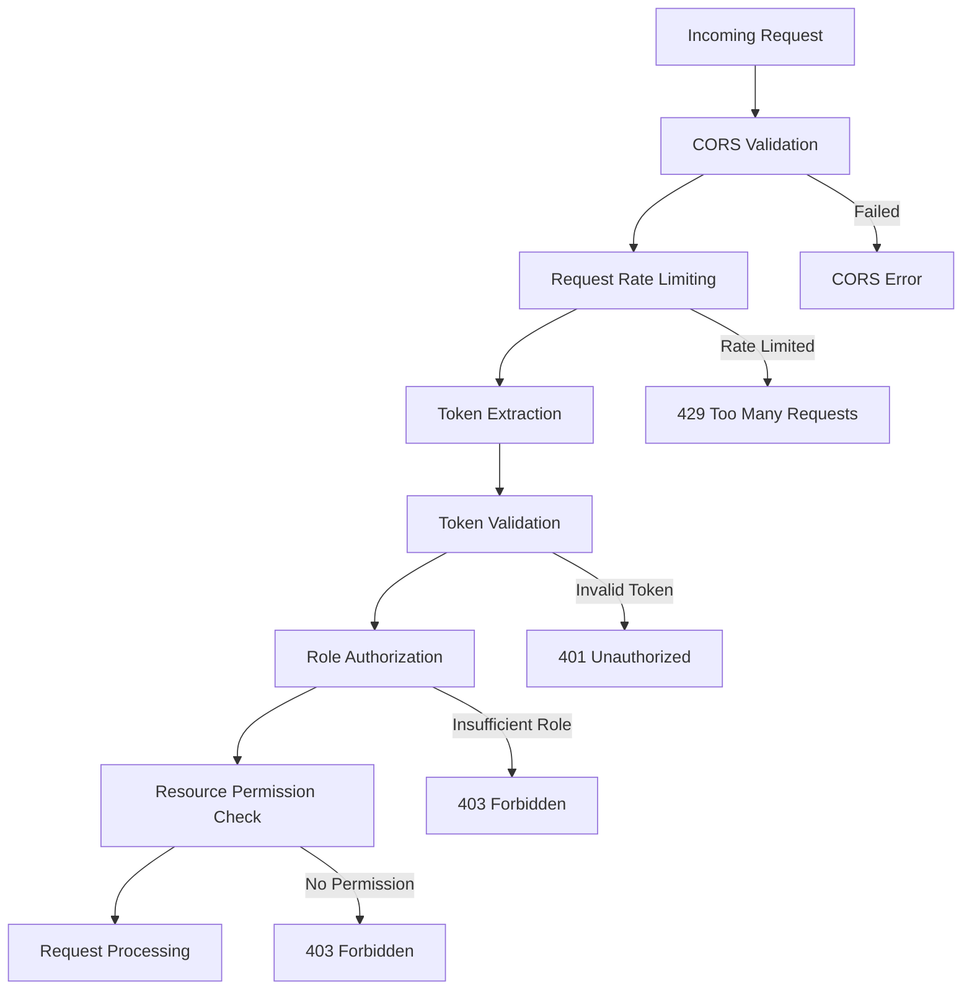

### Security Middleware Stack

| Layer | Purpose | Configuration | Error Handling |
|-------|---------|---------------|----------------|
| CORS | Cross-origin request control | Whitelist frontend domains | Block unauthorized origins |
| Rate Limiting | Prevent abuse and DoS | 100 requests/minute per IP | Progressive backoff |
| JWT Validation | Token authenticity | RSA256 signature verification | Token refresh or re-login |
| Role Authorization | Permission verification | Role-based access matrix | Redirect to appropriate login |

### Input Validation & Sanitization

#### Registration Data Validation

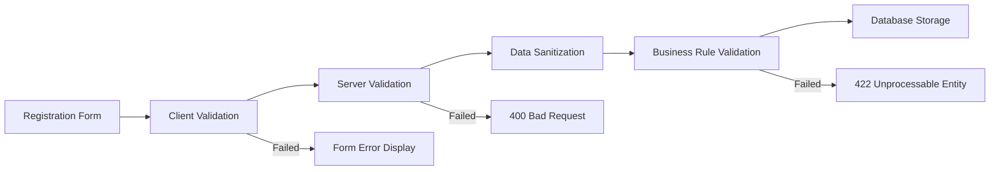

#### Validation Rules Matrix

| Field | Client Rules | Server Rules | Sanitization |
|-------|-------------|--------------|--------------|
| Email | Format, required | Uniqueness, domain validation | Lowercase, trim |
| Phone | Format, length | Country code validation | Remove special chars |
| Document Number | Format by type | Checksum validation | Uppercase, remove spaces |
| Password | Length, complexity | Hash strength verification | No modification |

## Testing Strategy

### Authentication Test Coverage

#### Unit Testing Framework

| Component | Test Categories | Coverage Target | Test Tools |
|-----------|----------------|-----------------|------------|
| Password Hashing | Hash generation, validation | 100% | Jest, bcrypt |
| JWT Operations | Token creation, validation, expiry | 100% | Jest, jsonwebtoken |
| Role Authorization | Permission matrix verification | 95% | Jest, custom helpers |
| Input Validation | All validation rules | 100% | Jest, validation library |

#### Integration Testing Scenarios

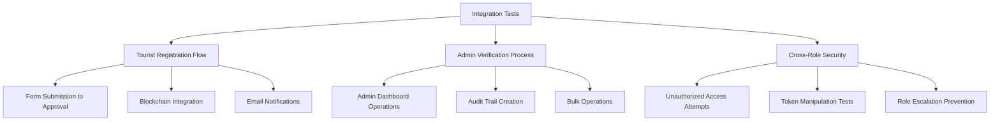

#### End-to-End Test Scenarios

| Test Case | Description | Expected Outcome | Priority |
|-----------|-------------|------------------|----------|
| Tourist Complete Registration | Full signup to verified account | Account active with blockchain ID | High |
| Admin Verification Workflow | Approve pending tourist application | Status updated, audit logged | High |
| Cross-Role Access Prevention | Tourist accessing admin routes | 403 Forbidden response | Critical |
| Session Expiry Handling | Token expiration during usage | Graceful re-authentication | Medium |
| Document Upload Validation | Invalid document submission | Clear error messages | Medium |

### Security Testing Protocol

#### Penetration Testing Areas

```
mindmap
  root)Security Testing(
    Authentication
      Brute Force
      Credential Stuffing
      Session Hijacking
    Authorization
      Privilege Escalation
      Role Bypass
      Resource Access
    Input Validation
      SQL Injection
      XSS Prevention
      File Upload Security
    Token Security
      JWT Manipulation
      Token Replay
      Signature Validation
```

#### Security Validation Checklist

| Security Area | Validation Points | Testing Method | Remediation Priority |
|---------------|-------------------|----------------|----------------------|
| Password Security | Hash strength, salt usage | Automated scanning | Critical |
| Session Management | Token expiry, refresh logic | Manual testing | High |
| Input Sanitization | XSS, injection prevention | Automated + manual | Critical |
| File Upload Security | Type validation, size limits | Manual testing | High |
| API Endpoint Security | Authorization, rate limiting | Automated scanning | High |