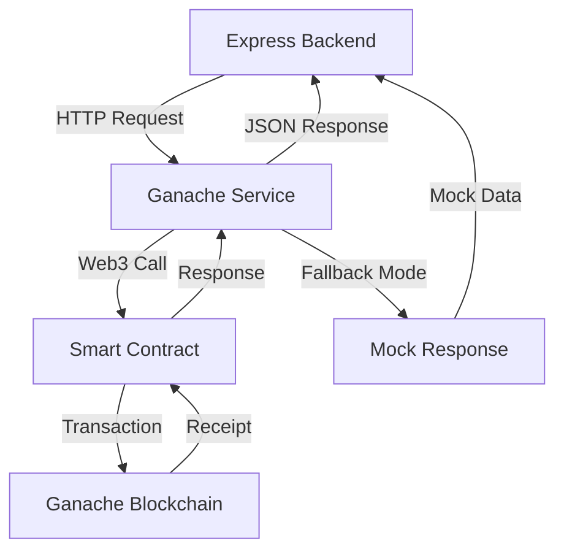

# Tourist Digital ID: Mock to Real Blockchain Migration Design

## Overview

This design outlines the migration strategy from the current mock blockchain system to a real blockchain implementation using Ganache GUI for local development. The migration maintains full backward compatibility with existing UI components while enabling true blockchain functionality for tourist digital ID registration and verification.

## Current System Analysis

### Mock System Architecture
The current system uses an Express-based mock service (`blockchain/mockServer.js`) that simulates blockchain operations using in-memory storage. Tourist registration flow:

1. User submits registration via frontend form
2. Admin approves tourist through admin dashboard
3. Backend calls `/createID` endpoint on mock blockchain service
4. Mock service generates fake blockchain ID and QR code
5. Tourist receives digital ID with mock verification

### Real System Architecture
The target system uses actual smart contracts deployed on Ganache with Web3 integration:

1. Smart contract `TouristDigitalID.sol` handles digital ID creation
2. Ganache service (`blockchain/ganacheService.js`) bridges Express backend and blockchain
3. Real blockchain transactions create immutable digital IDs
4. QR codes contain actual blockchain verification data

## Migration Strategy

### Phase 1: Environment Preparation

#### Ganache Configuration Setup
Establish connection between application and Ganache GUI instance:

- **Network Configuration**: Configure Hardhat to connect to Ganache GUI on `http://127.0.0.1:7545`
- **Account Management**: Set up admin account using private key from Ganache Account 0
- **Contract Deployment**: Deploy `TouristDigitalID.sol` to local Ganache network
- **Environment Variables**: Configure blockchain service connection parameters

#### Service Initialization Validation
Verify blockchain connectivity and contract accessibility:

- **Connection Testing**: Validate Web3 provider connectivity to Ganache
- **Contract Verification**: Confirm smart contract deployment and functionality
- **Account Balance**: Ensure sufficient ETH in admin account for transactions
- **Fallback Mechanisms**: Maintain mock service compatibility for offline scenarios

### Phase 2: Smart Contract Integration

#### Digital ID Creation Process
Transform mock ID generation to blockchain-based creation:

**Input Processing**:
- Tourist user ID validation and uniqueness checking
- Document hash generation from KYC information
- Personal data hash creation for privacy protection
- Expiration timestamp calculation (default 1 year validity)

**Blockchain Transaction**:
- Smart contract function call: `createDigitalID()`
- Gas estimation and transaction submission
- Transaction confirmation and receipt validation
- Digital ID number extraction from blockchain response

**Response Generation**:
- QR code creation with blockchain verification data
- Transaction hash storage for audit trail
- Blockchain status tracking for monitoring

#### Verification Enhancement
Upgrade verification process to use actual blockchain queries:

**On-Chain Verification**:
- Smart contract function call: `verifyDigitalID()`
- Status validation (Active, Suspended, Expired, Revoked)
- Expiration checking against blockchain timestamp
- Authority validation for ID authenticity

**Response Enrichment**:
- Detailed ID information retrieval from blockchain
- Verification level assessment
- Issuance and expiration date confirmation
- Authority address verification

### Phase 3: Service Layer Migration

#### Backend Integration Points
Modify existing Express endpoints to use real blockchain service:

**Tourist Approval Endpoint** (`/api/admin/approve/:userId`):
- Replace mock blockchain call with Ganache service call
- Maintain identical request/response format for UI compatibility
- Add blockchain transaction hash tracking
- Implement error handling with mock fallback

**Digital ID Retrieval** (`/api/tourist/digital-id/:userId`):
- Enhance with blockchain verification status
- Add on-chain validation for verified tourists
- Maintain existing response structure for frontend compatibility

#### Service Configuration Management
Implement environment-based service selection:

**Development Mode Flexibility**:
- Environment variable `BLOCKCHAIN_MODE` controls service selection
- Automatic fallback to mock when Ganache unavailable
- Service health monitoring and status reporting
- Configuration validation and error reporting

### Phase 4: Data Migration

#### Existing Tourist Data Conversion
Migrate verified tourists from mock to real blockchain:

**Migration Script Execution**:
- Identify tourists with mock blockchain IDs
- Generate proper blockchain transactions for existing verified tourists
- Update tourist records with real blockchain IDs
- Preserve audit trail and history information

**Data Integrity Validation**:
- Verify successful blockchain ID creation for all migrated tourists
- Confirm QR code regeneration with real blockchain data
- Validate verification status consistency
- Test end-to-end verification flow

## Technical Implementation Details

### Smart Contract Interaction

#### Digital ID Creation Transaction
```
Function: createDigitalID(
  touristUserId: string,
  name: string,
  kycHash: bytes32,
  personalHash: bytes32,
  expirationTimestamp: uint256,
  verificationLevel: uint8
)
Returns: digitalId: uint256
```

**Hash Generation Strategy**:
- KYC Hash: SHA-256 of document type and number
- Personal Hash: SHA-256 of name, email, and timestamp
- Verification Level: 1-5 scale based on document type (Passport=4, Aadhaar=3)

#### Verification Query Structure
```
Function: verifyDigitalID(digitalId: uint256)
Returns: (valid: bool, status: enum)

Function: getIDDetails(digitalId: uint256)
Returns: DigitalID struct with complete information
```

### Service Architecture

#### Ganache Service Bridge
The blockchain service acts as a bridge between Express backend and Ganache:



#### Error Handling and Fallback
Implement robust error handling with graceful degradation:

**Blockchain Unavailable Scenarios**:
- Ganache not running or unreachable
- Smart contract not deployed or invalid
- Insufficient gas or account balance
- Network connection issues

**Fallback Response Strategy**:
- Generate mock blockchain ID with clear fallback indication
- Maintain response format compatibility
- Log blockchain errors for debugging
- Provide health check endpoints for monitoring

### Quality Assurance Strategy

#### Testing Framework
Comprehensive testing approach covering all migration aspects:

**Smart Contract Testing**:
- Unit tests for all contract functions
- Integration tests for complete workflow
- Gas optimization and transaction cost analysis
- Security validation and access control testing

**API Integration Testing**:
- End-to-end tourist registration and approval flow
- Blockchain service health and connectivity testing
- Fallback mode validation and mock compatibility
- Performance testing under various load conditions

**User Experience Testing**:
- Frontend component compatibility verification
- QR code generation and scanning validation
- Error message clarity and user guidance
- Mobile responsiveness and cross-browser compatibility

## Risk Mitigation

### Technical Risks

#### Blockchain Service Availability
- **Risk**: Ganache service interruption affecting tourist operations
- **Mitigation**: Automatic fallback to mock service with clear status indication
- **Monitoring**: Health check endpoints and service status reporting

#### Data Consistency
- **Risk**: Mismatch between backend tourist records and blockchain state
- **Mitigation**: Migration validation scripts and data integrity checks
- **Recovery**: Re-sync mechanisms and manual verification tools

#### Performance Impact
- **Risk**: Blockchain transactions causing response delays
- **Mitigation**: Asynchronous processing and user feedback during operations
- **Optimization**: Gas optimization and transaction batching where applicable

### Operational Risks

#### Migration Downtime
- **Risk**: Service interruption during migration process
- **Mitigation**: Staged migration with backward compatibility maintenance
- **Rollback**: Quick revert to mock system if critical issues arise

#### User Impact
- **Risk**: Changes affecting existing user workflows
- **Mitigation**: Maintain identical UI/UX with enhanced backend functionality
- **Communication**: Clear status indicators and progress feedback

## Success Metrics

### Technical Metrics
- **Blockchain Transaction Success Rate**: >95% successful transaction completion
- **Service Availability**: >99% uptime for blockchain service with fallback
- **Response Time**: <3 seconds for digital ID creation operations
- **Data Integrity**: 100% consistency between tourist records and blockchain state

### User Experience Metrics
- **Registration Flow Completion**: Maintained current completion rates
- **Error Rate**: <1% user-facing errors during normal operations
- **Support Requests**: No increase in blockchain-related support issues

### Migration Metrics
- **Data Migration Success**: 100% of verified tourists successfully migrated
- **Fallback Activation**: <5% operations requiring mock service fallback
- **Post-Migration Stability**: No critical issues within 48 hours of migration

## Deployment Strategy

### Pre-Deployment Checklist
- [ ] Ganache GUI installed and configured
- [ ] Smart contracts compiled and deployment-ready
- [ ] Environment variables configured
- [ ] Migration scripts tested on development data
- [ ] Backup procedures established for rollback scenarios

### Deployment Sequence
1. **Environment Setup**: Configure Ganache and deploy smart contracts
2. **Service Validation**: Test blockchain service connectivity and functionality
3. **Data Migration**: Execute migration script for existing verified tourists
4. **Service Cutover**: Switch backend to use real blockchain service
5. **Validation Testing**: Comprehensive end-to-end testing with real blockchain
6. **Monitoring Setup**: Establish ongoing monitoring and alerting

### Post-Deployment Actions
- Monitor blockchain service performance and error rates
- Validate all migrated tourist digital IDs function correctly
- Confirm QR code verification works with real blockchain data
- Document any configuration adjustments or operational notes