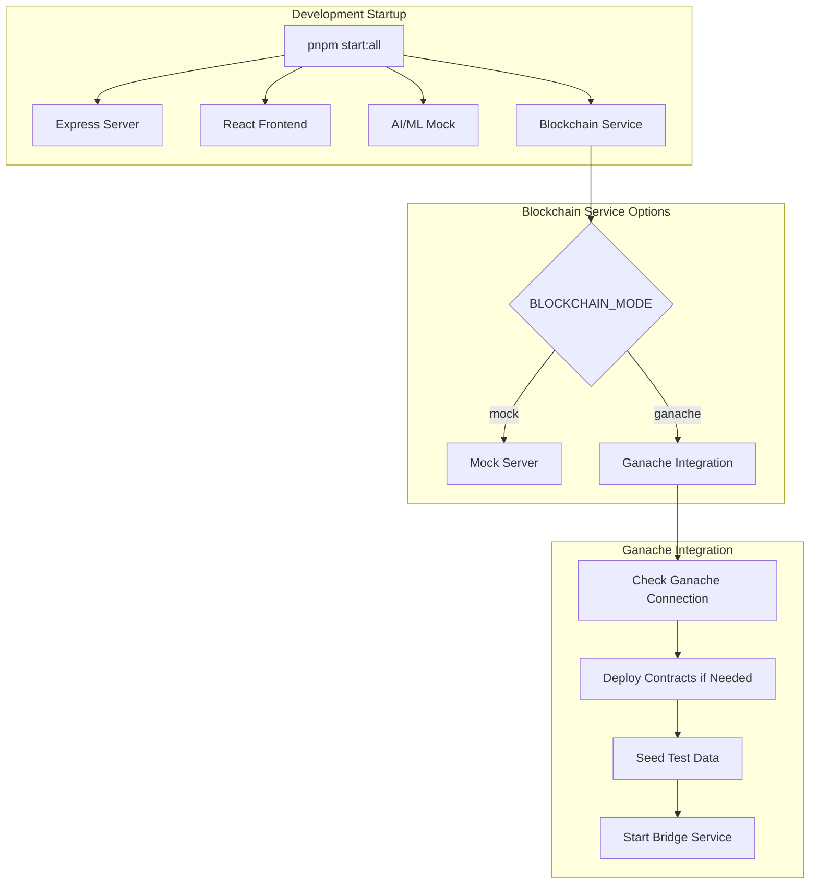
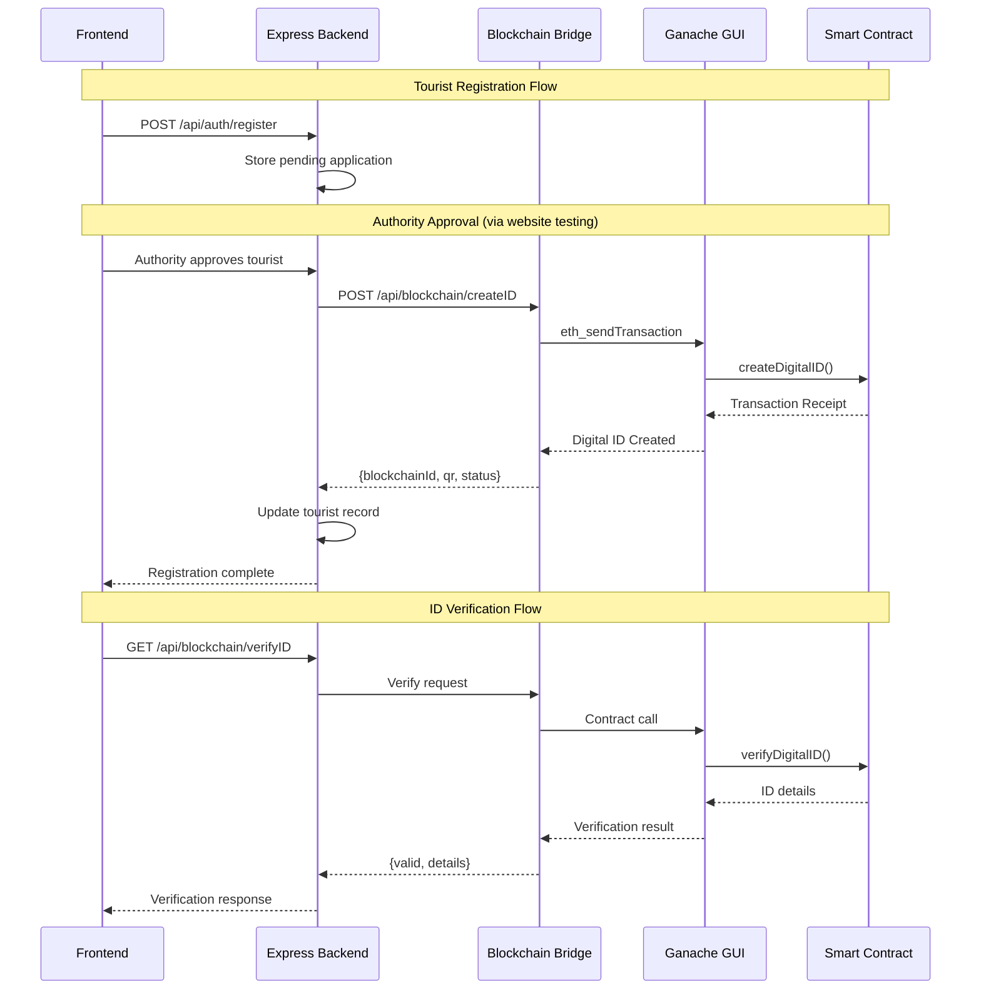
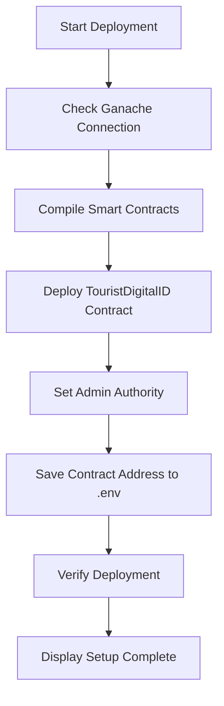
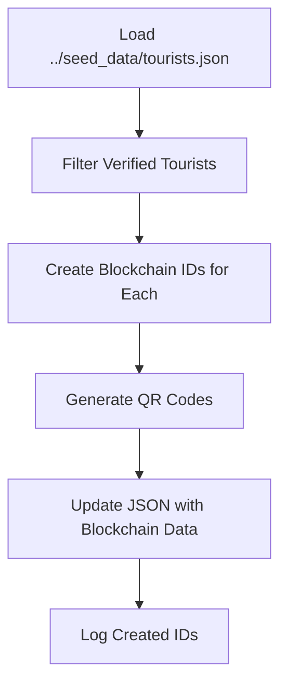
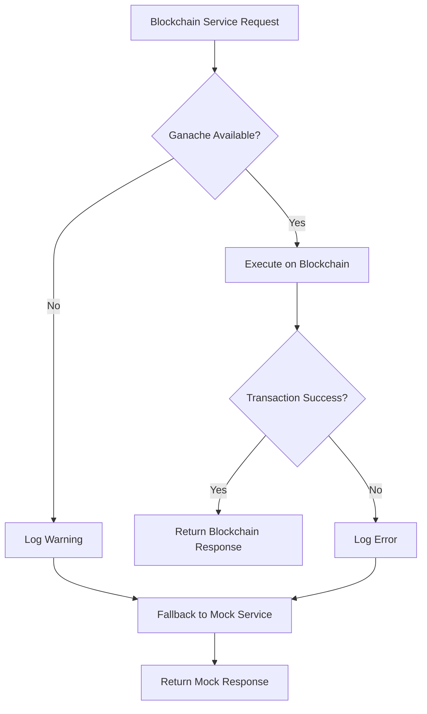

# Blockchain System Design for Tourist Digital ID Creation

## Overview

This design document outlines the development-phase blockchain infrastructure for creating and managing digital IDs for tourists using Ganache GUI and Hardhat. The system integrates seamlessly with the existing Express backend, maintaining the current mock service architecture while enabling transition to real blockchain functionality.

### Development Purpose
- Replace mock blockchain service with real Ganache-based implementation
- Maintain existing API endpoints for seamless frontend integration
- Enable hot-swappable transition between mock and real blockchain
- Provide robust testing environment using existing seed data
- Integrate with current pnpm-based development workflow

### Key Development Objectives
- **Mock Compatibility**: Preserve existing `/createID` and `/verifyID` endpoints
- **Easy Setup**: One-command deployment to Ganache GUI
- **Development Testing**: Use existing tourist seed data for testing
- **Environment Switching**: Toggle between mock and real blockchain via env vars
- **Error-Free Execution**: Robust error handling and fallback mechanisms

## Development Architecture

### Ganache GUI Integration

#### Network Configuration
- **Network ID**: 5777 (Ganache default)
- **RPC URL**: http://127.0.0.1:7545
- **Chain ID**: 1337
- **Gas Limit**: 6721975 (Ganache default)
- **Gas Price**: 20000000000 (20 Gwei)

#### Account Setup
```
Account Roles:
- Account 0: Primary Admin Authority (contract deployment & management)
- Accounts 1-3: Additional Authority accounts (for testing multi-authority scenarios)
- Accounts 4-9: Tourist accounts (for testing digital ID creation)
```

### Hardhat Development Environment

#### Project Structure
```
blockchain/
├── contracts/
│   ├── TouristDigitalID.sol
│   └── Migrations.sol
├── scripts/
│   ├── deploy.js
│   ├── seed-data.js
│   └── migrate-from-mock.js
├── test/
│   ├── TouristDigitalID.test.js
│   └── integration.test.js
├── hardhat.config.js
├── package.json
└── .env.blockchain
```

#### Development Workflow Integration


### Component Interactions



## Smart Contract Architecture

### TouristDigitalID Contract (Solidity)

#### Development-Focused Data Model
Optimized for Ganache testing and development workflow:

| Field | Type | Description | Development Notes |
|-------|------|-------------|------------------|
| digitalId | uint256 | Auto-incrementing ID counter | Starts from 1, simple for testing |
| touristUserId | string | Maps to existing tourist._id | Links to seed data |
| authorityAddress | address | Ganache account that approved | Admin account (Account 0) |
| kycDocumentHash | bytes32 | Hash of uploaded document | SHA256 of document filename |
| personalDataHash | bytes32 | Hash of personal info | For privacy in development |
| issueTimestamp | uint256 | Block timestamp | Ganache block time |
| expirationTimestamp | uint256 | ID validity period | 1 year from issue |
| status | enum | Active, Suspended, Expired | Default: Active |
| verificationLevel | uint8 | 1-5 completeness scale | Based on document type |

#### Smart Contract Interface

**Core Functions for Development**
```
// Administrative (Account 0 only)
function setAuthority(address _authority, bool _isAuthorized)
function pauseContract() // Emergency stop
function unpauseContract()

// ID Management (Authorized addresses only) 
function createDigitalID(
    string memory _touristUserId,
    string memory _name,
    bytes32 _kycHash,
    bytes32 _personalHash,
    uint256 _expirationTimestamp,
    uint8 _verificationLevel
) returns (uint256 digitalId)

function updateIDStatus(uint256 _digitalId, Status _newStatus)
function renewDigitalID(uint256 _digitalId, uint256 _newExpiration)

// Verification (Public read-only)
function verifyDigitalID(uint256 _digitalId) view returns (bool valid, Status status)
function getIDDetails(uint256 _digitalId) view returns (IDDetails memory)
function getIDByTouristId(string memory _touristUserId) view returns (uint256)
```

#### Development-Specific Features

**Testing Helper Functions**
```
// Only available in development
function batchCreateIDs(IDData[] memory _tourists) // Seed multiple IDs
function resetContract() onlyOwner // Clear all data for fresh testing
function getContractStats() view returns (uint256 totalIDs, uint256 activeIDs)
```

**Event Logging for Development**
```
event DigitalIDCreated(uint256 indexed digitalId, string touristUserId, address authority);
event IDStatusUpdated(uint256 indexed digitalId, Status oldStatus, Status newStatus);
event IDVerificationRequested(uint256 indexed digitalId, address verifier);
```

## Integration with Existing Express Backend

### API Endpoint Compatibility

Maintaining existing mock service API for seamless frontend integration:

#### Enhanced `/createID` Endpoint
**Existing Mock Behavior Preserved**
```
POST /createID
Request: {
  "userId": "t123",
  "name": "Alice Kumar", 
  "kycHash": "sha256:...",
  "itinerary": [],
  "validUntil": "2025-09-20T00:00:00Z"
}

Response: {
  "blockchainId": "1" // Now real blockchain ID instead of "bc_0xabc123"
  "qr": "data:image/png;base64,...", // QR contains real blockchain ID
  "status": "created",
  "expiresAt": "2025-09-20T00:00:00Z",
  "transactionHash": "0x1234..." // New field with Ganache tx hash
}
```

#### Enhanced `/verifyID` Endpoint  
**Existing Mock Behavior Preserved**
```
GET /verifyID?blockchainId=1
Response: {
  "blockchainId": "1", // Real blockchain ID
  "userId": "t123",
  "valid": true, // From smart contract verification
  "issuedAt": "2025-09-15T00:00:00Z",
  "expiresAt": "2025-09-20T00:00:00Z",
  "verificationLevel": 3, // New field from contract
  "onChain": true // Indicates real blockchain vs mock
}
```

### Environment-Based Service Switching

#### Configuration via Environment Variables
```
# .env file additions
BLOCKCHAIN_MODE=ganache # Options: "mock" | "ganache"
GANACHE_URL=http://127.0.0.1:7545
GANACHE_NETWORK_ID=5777
CONTRAT_ADDRESS=0x... # Auto-populated after deployment
ADMIN_PRIVATE_KEY=0x... # Account 0 private key from Ganache
```

#### Blockchain Service Factory Pattern
```mermaid
graph TB
    A[Express Backend Startup] --> B{BLOCKCHAIN_MODE}
    B -->|"mock"| C[MockBlockchainService]
    B -->|"ganache"| D[GanacheBlockchainService]
    
    subgraph "Service Interface"
        E[createDigitalID()]
        F[verifyDigitalID()]
        G[updateIDStatus()]
    end
    
    C --> E
    C --> F
    C --> G
    
    D --> E
    D --> F
    D --> G
    
    subgraph "Implementation Details"
        C --> H[Static Mock Data]
        D --> I[Ganache Web3 Integration]
        I --> J[Smart Contract Calls]
    end
```

### Express Backend Integration

#### Enhanced Tourist Registration Flow
Integrating blockchain ID creation with existing registration workflow:

| Registration Step | Current Implementation | Enhanced with Blockchain |
|------------------|----------------------|-------------------------|
| Form Submission | Store in tourists array | Store in tourists array + prepare blockchain data |
| Authority Review | Manual approval via admin UI | Manual approval via website testing |
| Approval Action | Update verificationStatus | Update verificationStatus + trigger blockchain ID creation |
| Tourist Notification | "Application approved" | "Digital ID created" + QR code |

#### Database Schema Integration
Extending existing Tourist type for blockchain integration:

```
// Enhanced Tourist type (server/index.ts)
type Tourist = {
  _id: string;
  name: string;
  email: string;
  phone?: string;
  itinerary?: string;
  emergencyName?: string;
  emergencyPhone?: string;
  documentType?: "aadhaar" | "passport";
  documentNumber?: string;
  documentFileName?: string;
  verificationStatus: "pending" | "verified" | "rejected" | "archived";
  history?: { action: string; admin?: string; notes?: string; timestamp: string }[];
  applicationDate?: string;
  
  // New blockchain fields
  blockchainId?: string; // Digital ID from smart contract
  transactionHash?: string; // Ganache transaction hash
  blockchainStatus?: "none" | "pending" | "created" | "failed";
  qrCodeData?: string; // Base64 QR code for digital ID
};
```

#### Seed Data Integration
Using existing `seed_data/tourists.json` for blockchain testing:

```
Development Workflow:
1. Load existing tourist seed data
2. Create blockchain IDs for "verified" tourists
3. Update tourist records with blockchain information
4. Generate QR codes for testing verification
```

## Development Setup and Deployment

### Hardhat Configuration

#### Project Initialization
```
Setup Steps:
1. Navigate to blockchain/ directory
2. Initialize Hardhat project
3. Configure for Ganache GUI integration
4. Create deployment scripts
5. Integrate with pnpm scripts
```

#### Hardhat Configuration for Ganache
```javascript
// hardhat.config.js
require("@nomicfoundation/hardhat-toolbox");
require("dotenv").config({ path: ".env.blockchain" });

module.exports = {
  solidity: {
    version: "0.8.19",
    settings: {
      optimizer: {
        enabled: true,
        runs: 200
      }
    }
  },
  networks: {
    ganache: {
      url: "http://127.0.0.1:7545",
      accounts: [process.env.ADMIN_PRIVATE_KEY], // Account 0 from Ganache
      chainId: 1337,
      gas: 6721975,
      gasPrice: 20000000000
    },
    development: {
      url: "http://127.0.0.1:7545",
      network_id: "*"
    }
  },
  paths: {
    sources: "./contracts",
    tests: "./test",
    cache: "./cache",
    artifacts: "./artifacts"
  }
};
```

### Development Scripts Integration

#### Enhanced Package.json Scripts
```json
{
  "scripts": {
    // Existing scripts preserved
    "dev": "vite",
    "dev:blockchain": "node blockchain/mockServer.js",
    "dev:aiml": "node aiml/mockServer.js", 
    "start:all": "concurrently \"pnpm dev\" \"pnpm dev:blockchain\" \"pnpm dev:aiml\"",
    
    // New blockchain development scripts
    "blockchain:setup": "cd blockchain && npm install && npx hardhat compile",
    "blockchain:deploy": "cd blockchain && npx hardhat run scripts/deploy.js --network ganache",
    "blockchain:seed": "cd blockchain && npx hardhat run scripts/seed-data.js --network ganache",
    "blockchain:migrate": "cd blockchain && npx hardhat run scripts/migrate-from-mock.js --network ganache",
    "dev:blockchain:real": "cd blockchain && npm start",
    "start:all:blockchain": "concurrently \"pnpm dev\" \"pnpm dev:blockchain:real\" \"pnpm dev:aiml\""
  }
}
```

#### Environment Configuration
```
# .env (root project)
BLOCKCHAIN_MODE=ganache
BLOCKCHAIN_API_URL=http://localhost:5002

# .env.blockchain (blockchain directory)  
GANACHE_URL=http://127.0.0.1:7545
NETWORK_ID=5777
ADMIN_PRIVATE_KEY=0x... # Copy from Ganache GUI Account 0
CONTRACT_ADDRESS= # Auto-populated after deployment
```

### One-Command Deployment Process

#### Quick Setup for Development
```bash
# 1. Setup blockchain development environment
pnpm blockchain:setup

# 2. Start Ganache GUI (manual step)
# Open Ganache GUI and create/open workspace
# Copy Account 0 private key to .env.blockchain

# 3. Deploy contracts and seed data
pnpm blockchain:deploy
pnpm blockchain:seed

# 4. Start development with real blockchain
pnpm start:all:blockchain
```

#### Deployment Scripts Workflow

**deploy.js Script Flow**


**seed-data.js Script Flow**


### Error-Free Execution Strategies

#### Robust Error Handling
```
Deployment Safety Checks:
1. Verify Ganache is running before deployment
2. Check account balance for gas fees
3. Validate contract compilation before deployment
4. Rollback mechanism for failed deployments
5. Graceful fallback to mock service if blockchain fails
```

#### Fallback Mechanisms


## Testing Integration with Website

### Using Existing Seed Data for Testing

#### Tourist Test Scenarios
Leveraging `seed_data/tourists.json` for comprehensive blockchain testing:

| Test Scenario | Tourist Data | Expected Blockchain Behavior |
|---------------|--------------|------------------------------|
| New Registration | Fresh tourist application | Create pending status, no blockchain ID |
| Authority Approval | Change status to "verified" | Trigger blockchain ID creation |
| ID Verification | Use generated QR code | Validate against smart contract |
| Status Updates | Admin changes to "suspended" | Update blockchain status |
| Expiration Testing | Set past expiration date | Contract returns invalid status |

#### Test Data Migration Strategy
```
Testing Workflow:
1. Load existing tourists.json seed data
2. Identify tourists with "verified" status
3. Create blockchain IDs for verified tourists  
4. Generate QR codes for frontend testing
5. Test verification flow with generated IDs
6. Test admin functions (suspend/renew/revoke)
```

### Frontend Testing Integration

#### Existing Components Enhanced for Blockchain

**Registration Flow Testing**
- Use existing `/auth/register` page
- Test authority approval via Admin dashboard
- Verify blockchain ID creation in tourist record
- Test QR code generation and display

**Admin Dashboard Testing**
- Use existing Admin page for tourist management
- Test blockchain ID creation on approval
- Verify transaction hash display
- Test status updates reflected on blockchain

**Verification Testing**
- Create test verification component
- Scan generated QR codes
- Test various ID statuses (active, suspended, expired)
- Verify blockchain response accuracy

### Development Testing Scenarios

#### Multi-Authority Testing
```
Ganache Account Setup for Testing:
- Account 0: Primary Admin (contract deployment)
- Account 1: Police Authority (ID verification testing)
- Account 2: Tourism Department (bulk ID creation)
- Accounts 3-9: Tourist accounts (ID ownership testing)
```

#### Error Condition Testing
```
Robustness Testing Scenarios:
1. Ganache disconnection during operation
2. Invalid digital ID verification attempts
3. Duplicate ID creation prevention
4. Authority permission edge cases
5. Contract interaction timeout handling
```

### Testing Commands and Scripts

#### Development Testing Workflow
```bash
# Start complete development environment
pnpm start:all:blockchain

# In separate terminal - run specific tests
cd blockchain
npx hardhat test # Run smart contract tests
npx hardhat run scripts/test-scenarios.js --network ganache

# Test blockchain service endpoints
curl http://localhost:5002/createID -X POST -H "Content-Type: application/json" -d '...'
curl http://localhost:5002/verifyID?blockchainId=1
```

#### Integration Testing with Frontend
```
Manual Testing Checklist:
1. ✓ Register new tourist through website
2. ✓ Approve tourist via admin dashboard  
3. ✓ Verify blockchain ID created
4. ✓ Test QR code generation
5. ✓ Verify ID through verification endpoint
6. ✓ Test status updates (suspend/renew)
7. ✓ Test fallback to mock service
```