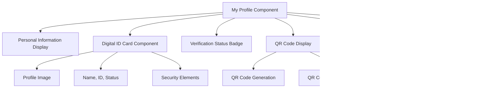

# Digital ID Registration System Design

## Overview

The Digital ID Registration System extends the existing YatraRakshak tourist safety platform to provide secure, blockchain-based digital identity creation for tourists. Upon successful registration, users receive a unique blockchain token that serves as their digital tourist ID, enabling seamless integration with safety monitoring and emergency response features.

## Architecture

### Component Integration Flow

### System Architecture

## Registration Flow Architecture

### Multi-Step Registration Process

| Step | Form Section | Required Fields | Validation |
|------|-------------|----------------|------------|
| 1 | Personal Information | Full Name, Email, Phone, Password | Email format, Phone format, Password strength |
| 2 | Travel Details | Planned Itinerary, Emergency Contact Name, Emergency Contact Phone | Minimum text length, Phone format |
| 3 | Document Verification | Document Type (Aadhaar/Passport), Document Number, Document Upload | File format validation, Document number format |
| 4 | Consent & Terms | Terms Agreement, Document Verification Consent | Mandatory checkbox validation |

### Registration Data Model

### Blockchain Integration Model

| Field | Type | Description | Source |
|-------|------|-------------|--------|
| blockchainId | string | Unique token identifier (e.g., bc_0xabc123) | Blockchain Mock Service |
| transactionHash | string | Blockchain transaction reference | Blockchain Mock Service |
| blockchainStatus | enum | Token creation status | Backend Processing |
| qrCodeData | string | Base64 encoded QR code | Blockchain Mock Service |
| issuedAt | timestamp | Token creation timestamp | Blockchain Mock Service |
| expiresAt | timestamp | Token expiration date | Blockchain Mock Service |

## API Endpoints Reference

### Registration Endpoints

| Endpoint | Method | Purpose | Request Body | Response |
|----------|--------|---------|--------------|----------|
| `/api/auth/register` | POST | Create new tourist registration | Registration form data | Success status, userId, verification status |
| `/api/auth/login` | POST | Authenticate registered user | Email, password | JWT token, refresh token, user role |
| `/api/tourist/profile/:userId` | GET | Retrieve tourist profile data | - | Complete tourist profile |
| `/api/tourist/digital-id/:userId` | GET | Get digital ID information | - | Blockchain ID, QR code, verification status |

### Blockchain Integration Endpoints

| Endpoint | Method | Purpose | Request Body | Response |
|----------|--------|---------|--------------|----------|
| `/api/blockchain/create-id` | POST | Generate blockchain token | userId, name, documentHash | blockchainId, QR code, expiration |
| `/api/blockchain/verify-id` | GET | Validate blockchain token | blockchainId query parameter | Validation status, issue/expire dates |

### Admin Verification Endpoints

| Endpoint | Method | Purpose | Request Body | Response |
|----------|--------|---------|--------------|----------|
| `/api/admin/pending-verifications` | GET | List pending registrations | Query filters (status, search) | Paginated registration list |
| `/api/admin/verify/:userId` | POST | Approve registration | Admin notes, verification decision | Success status |
| `/api/admin/document/:userId` | GET | Retrieve uploaded documents | Admin authentication header | Document file or metadata |

## Component Architecture

### Registration Form Component Structure

### My Profile Page Component

### Digital ID Card Design Elements

| Component | Description | Data Source | Styling |
|-----------|-------------|-------------|---------|
| Profile Header | Tourist name, ID number, verification status | Tourist data record | Gradient background, status badges |
| QR Code | Blockchain ID verification code | Blockchain service response | Center-aligned, bordered |
| Security Elements | Issue date, expiration, blockchain hash | Blockchain token metadata | Small text, security styling |
| Status Badge | Verification status indicator | Tourist verification status | Color-coded badges |
| Action Buttons | Download, share, refresh options | Component functionality | Consistent button styling |

## Business Logic Layer

### Registration Processing Workflow

### Verification State Management

| Status | Description | Actions Available | Next States |
|--------|-------------|------------------|-------------|
| pending | Initial registration submitted | Admin review, document verification | verified, rejected |
| verified | Admin approved registration | Access all features, blockchain activation | archived |
| rejected | Admin rejected registration | Re-submit with corrections | pending |
| archived | Deactivated registration | Admin review only | - |

### Blockchain Token Lifecycle

## Data Flow Between Layers

### Registration Data Flow

### Profile Page Data Retrieval

## Admin Verification Interface

### Verification Dashboard Components

| Component | Purpose | Data Display | Actions |
|-----------|---------|-------------|---------|
| Pending List | Show unverified registrations | Name, email, application date, document type | View details, approve, reject |
| Document Viewer | Display uploaded documents | Document images/PDFs | Zoom, download, annotate |
| Verification Form | Admin decision interface | Approval status, notes field | Submit decision |
| Activity Log | Track admin actions | Admin name, action, timestamp, notes | Filter, search |

### Admin Actions Workflow

## Security & Privacy Considerations

### Document Handling Security

| Aspect | Implementation | Security Level |
|--------|---------------|----------------|
| Document Upload | File type validation, size limits | Basic validation |
| Document Storage | Local filesystem with restricted access | Development only |
| Document Access | Admin authentication headers | Development authentication |
| Document Hashing | SHA-256 hash for document numbers | Standard hashing |
| Data Transmission | HTTPS for production (HTTP for dev) | Development phase |

### Blockchain Token Security

| Security Feature | Implementation | Purpose |
|-----------------|---------------|---------|
| Unique Token ID | Timestamp-based generation | Prevent token duplication |
| QR Code Validation | Base64 encoded token data | Enable offline verification |
| Expiration Dates | 5-year validity period | Limit token lifetime |
| Transaction Hash | Mock blockchain reference | Audit trail capability |
| Verification Status | Multi-state status tracking | Control token activation |

## Integration Points

### Existing System Integration

| Integration Point | Current Component | New Functionality |
|------------------|------------------|------------------|
| Landing Page | Register button link | Redirect to registration form |
| Navigation | NavBar component | Add "My Profile" link for authenticated users |
| Authentication | Basic login/register | Enhanced with profile management |
| Tourist Dashboard | Static user display | Dynamic profile-based display |
| Admin Interface | Tourist verification | Enhanced with document review |

### External Service Dependencies

| Service | Purpose | Fallback Strategy |
|---------|---------|------------------|
| Blockchain Mock | Digital ID token creation | Local mock response generation |
| AI/ML Mock | Document verification assistance | Manual admin verification only |
| File Storage | Document upload handling | Local filesystem storage |
| Email Service | Verification notifications | Console logging for development |

## Testing Strategy

### Registration Flow Testing

| Test Category | Test Cases | Validation Points |
|---------------|------------|------------------|
| Form Validation | Input field validation, step navigation | Error handling, required field checks |
| Document Upload | File type validation, upload success | File acceptance, error messaging |
| API Integration | Registration submission, response handling | Success/failure scenarios |
| Blockchain Integration | Token creation, fallback scenarios | Service availability, error recovery |

### Profile Page Testing

| Test Scenario | Expected Behavior | Validation Criteria |
|---------------|------------------|-------------------|
| Authenticated Access | Profile data display | Correct user data rendering |
| QR Code Generation | Valid QR code creation | Readable QR code output |
| Verification Status | Status badge display | Accurate status representation |
| Document Security | Restricted document access | Proper access control |

### Admin Interface Testing

| Test Area | Test Focus | Success Metrics |
|-----------|------------|----------------|
| Verification Queue | Pending registration display | Complete registration list |
| Document Access | Secure document retrieval | Authorized access only |
| Decision Processing | Approval/rejection workflow | Status update propagation |
| Activity Logging | Admin action tracking | Comprehensive audit trail |